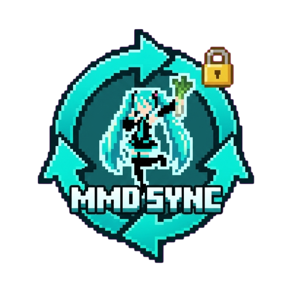


<p align="center">
  
</p>

**MMDSync** 是 [MC-MMD-rust](https://github.com/shiroha-233/MC-MMD-rust) 模组的附属扩展，主要用来解决多人游戏中 MMD 模型（PMX）、动作（VMD）和贴图的同步问题。

> [!IMPORTANT]
> **本模组必须配合 [MC-MMD-rust](https://github.com/shiroha-233/MC-MMD-rust) 使用**。
> 目前模组端支持 Minecraft **1.21.1** 版本；插件服务端配合 [MmdSkin-Bukkit](https://github.com/opdent-cmd/MmdSkin-Bukkit) 使用，配合跨版本插件理论上对服务端没有版本限制（只要插件跑得起来）。

## ✨ 功能特性

*   **游戏内上传模型**：无需手动分发文件，直接在游戏内点击“上传模型资源”按钮，通过系统原生文件对话框（支持 ZIP、单文件、文件夹）即可完成上传。
*   **自动增量同步**：玩家进服时，模组会自动对比服务器与本地缓存，增量下载缺失的模型或动作文件，支持 GZIP 压缩。
*   **端到端加密保护**：同步过程与本地存储均经过加密，有效防止模型资源被非法提取。
*   **服务器绑定**：同步的模型资源与当前服务器 ID 严格绑定。切换服务器或退服后，相关模型将自动隐藏并释放内存，确保存储隔离。
*   **多平台支持**：原生支持 NeoForge、Fabric 模组版，并提供配套的 [Bukkit/Paper 插件版](https://github.com/opdent-cmd/MmdSkin-Bukkit)。

## 🛠️ 安装与使用

### 1. 服务端 (NeoForge / Fabric / Bukkit)
1. 将对应的 `.jar` 放入 `mods` 或 `plugins` 文件夹。
2. 启动服务器以生成配置文件：
   - 模组版：`config/mmdsync-common.toml`
   - 插件版：`plugins/MmdSkin/config.yml`

### 2. 客户端 (NeoForge / Fabric)
1. 安装模组并进入服务器。
2. 在 MMD 模型选择界面或通过管理员命令打开“上传模型资源”界面。
3. 选择对应的资源类型（PMX/VMD）和上传方式，即可将本地模型同步至服务器。
4. 管理员可使用 `/mmdsync` 强制全局同步，使用 `/mmdsync reload` 重载配置。

## ⚙️ 配置文件说明 (Mod 示例)

```toml
[general]
# 服务器唯一私密盐 (用于加固加密流程，请勿公开)
serverSecret = "自动生成的随机密钥"

# 资源分块等待超时(秒)
# 0 或负数 = 无限等待直到文件传完
# 正数 = 单个文件在该时间内未传完则视为传输失败
resourcePacketWaitTimeoutSeconds = 0
```

## 📄 许可证

MIT License
